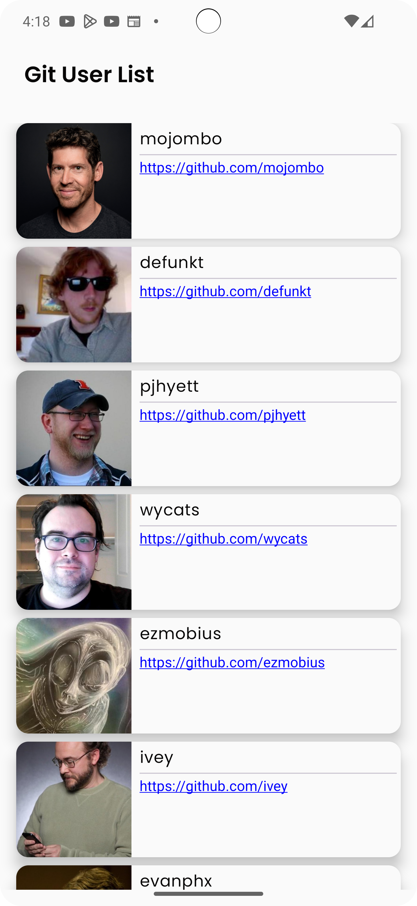

# Git User App Demo
This repository contains a demo Android application built for the Tymex company interview process. The app demonstrates the use of Jetpack Compose, Koin for dependency injection, Room for local database, Ktor for remote data, and modern Android development practices by implementing a two-screen interface that interacts with the GitHub API.

## Table of Contents
- [Features](#features)
- [Screenshots](#screenshots)
- [Tech Stack](#tech-stack)
- [Screens](#screen)
- [Navigation](#navigation)
- [Installation and Setup](#installation-and-setup)
- [How to Use](#how-to-use)
- [Contact](#contact)

## Features
- **Git User List Screen**: Displays a list of GitHub users fetched from the GitHub API..
- **Git User Detail Screen**: Shows detailed information about a selected GitHub user.

## Screenshots



## Tech Stack
- **Kotlin**: The main language used for app development.
- **Jetpack Compose**: The UI toolkit for building declarative UIs.
- **Koin**: Dependency injection framework.
- **ViewModel & LiveData**: For managing UI-related data in a lifecycle-conscious way.
- **Coroutines & Flow**: For handling asynchronous tasks
- **Ktor**: Networking library to fetch data from the GitHub API
- **Room**: Database management

## Screens
1. **Git User List Screen**:


- Displays a list of GitHub users.
- Clicking on a user navigates to the detail screen.

2. **Git User Detail Screen**:


- Shows detailed information of the selected user such as their login, follower count, following count, and blog URL.
- Includes a back button to navigate back to the user list.

### Game Objectives
- Defeat the devil by having a higher power level.
- Strategically choose which swords to collect to optimize your strength.

### Navigation
The app uses Jetpack Compose's NavHost to handle navigation between the two screens.

- GitUserListScreen → Navigate to GitUserDetailScreen with the user's login passed as a parameter.
- State and data persistence are handled using ViewModel.

## Installation and Setup
1. Clone this repository:
```bash
git clone https://github.com/VuongDo92/GitUser.git
```
2. Open the project in Android Studio.
3. Build and run the project on an Android emulator or physical device.

- Start the game and select your warrior.
- As you encounter swords, decide whether to pick them up based on their value and weight.
- Engage in battles with the devil and see if your final power is enough to win!

## How to Use
- Launch the app to view a list of GitHub users.
- Tap on any user to view more details about them.
- Use the back button to return to the user list.

## Contact
If you have any questions or feedback, feel free to reach out at:

- Email: vuongdt92@gmail.com or vuongdotuan@gmail.com
- GitHub: https://github.com/VuongDo92
- Linkedin: https://www.linkedin.com/in/vuongdotuan/

##

This README provides an overview of the app’s functionality, tech stack, and usage instructions. Adjust the repository link and contact details as necessary.

